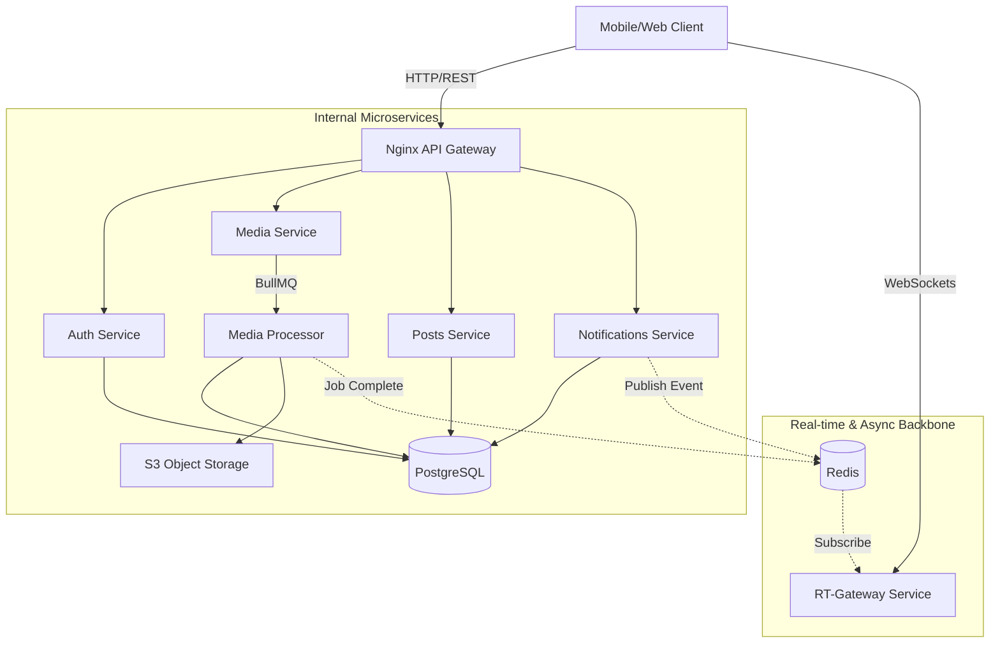

# Lumina Backend: Architectural Whitepaper

## 1. Executive Summary
Lumina Backend is a high-performance, event-driven social media infrastructure designed with a **NestJS Monorepo** microservices architecture. It addresses common scalability challenges in social platforms—such as heavy media processing, real-time notification fatigue, and social graph management—by decoupling concerns into specialized, independently scalable services.

## 2. System Architecture & Flow

The system utilizes a distributed architecture with a centralized **Nginx API Gateway**, a **PostgreSQL** persistence layer via **Prisma ORM**, and a **Redis** backbone for both task queuing (**BullMQ**) and real-time event distribution (**Pub/Sub**).

---

## 3. Service Deep-Dives

### 3.1 Auth & Social Graph (`apps/auth`)
The Auth service manages user identity and the complex relationships between them.
*   **Secure Authentication:** Employs `bcrypt` for password hashing and `jsonwebtoken` (JWT) for stateless session management.
*   **Private/Public Logic:** Implements a state-machine for following users. If an account is `private`, the follow status is set to `pending`. Acceptance requires an explicit transaction that updates counts for both users atomically.
*   **Atomic Transactions:** Uses Prisma's `$transaction` to ensure that incrementing a `followerCount` and creating a `Follow` record are atomic, preventing data drift.

### 3.2 Media Lifecycle Pipeline (`apps/media`)
Media handling is the most resource-intensive part of the system. It follows a "Sign-Upload-Process" workflow to offload heavy lifting from the API.

1.  **Direct-to-Cloud Upload:** Instead of proxying multi-megabyte files through the backend, the service generates **S3-signed URLs**, allowing clients to upload directly to storage.
2.  **Asynchronous Orchestration:** Once uploaded, the client notifies the service, which queues a job in **BullMQ**.
3.  **Advanced Processing (The "Pipeline"):**
    *   **Images:** Uses `Sharp` for high-performance transformations. It generates multiple derivatives (e.g., `thumb`, `feed`) and converts them to the efficient `WebP` format.
    *   **Videos:** Uses `FFmpeg` to extract high-resolution poster frames at specific timestamps (0.1s).
    *   **UX Optimization:** Generates **BlurHash** strings for all media, enabling "instant-load" placeholder states on the client.
4.  **Fault Tolerance:** Implements a "Database-First, Storage-Second" rollback strategy. If a processing job fails, the system purges temporary assets and reverts database states to maintain consistency.

### 3.3 Content Engine (`apps/posts`)
Handles the lifecycle of posts, comments, and user interactions.
*   **Feed Generation:** Utilizes **Cursor-based Pagination** (O(1) lookups) rather than offset-based (O(n)), ensuring consistent performance as the database grows.
*   **Recursive Threading:** Supports multi-level nested comments via a self-referencing `parentId` relationship.
*   **Mention Extraction:** Automatically parses `@username` patterns using regex and validates them against the database before creating relationships.

### 3.4 Intelligent Notifications (`apps/notifications`)
To prevent notification fatigue, the system implements an **Actor-Aggregation** model.

*   **Aggregation Logic:** Instead of "A liked your post" and "B liked your post," the system aggregates these into "A and B and 5 others liked your post."
*   **Redis-Backed Staging:** Uses Redis sets to temporarily stage actors before flushing them into the database, reducing write-heavy contention.
*   **Metadata Injection:** Injects visual context (e.g., a post thumbnail) into the notification record for a richer user experience.

### 3.5 Real-time Backbone (`apps/rt-gateway`)
The RT-Gateway is a stateless **Socket.io** server that provides a persistent connection to clients.
1.  **statelessness:** The gateway doesn't track which user is on which server instance; it uses **Redis Pub/Sub** to broadcast events.
2.  **User Isolation:** Upon connection, every user is automatically joined to a private room `user_{userId}`.
3.  **Event Routing:** When a service (like Notifications) wants to send a live update, it publishes a message to the `realtime_channel`. The gateway subscribers pick it up and route it to the specific user room.

---

## 4. Technical Design Principles

### 4.1 Data Modeling Strategy
The PostgreSQL schema (managed via Prisma) is optimized for high-read social scenarios:
*   **Composite Indexes:** Uses `@@index([userId, status, hidden, createdAt(sort: Desc)])` for extremely fast feed fetching.
*   **JSON Fields:** Stores actor lists and dynamic metadata as `Json` in the Notification model to balance flexibility with relational integrity.

### 4.2 Error Handling & Validation
*   **Custom Validation Pipe:** Extends NestJS's `ValidationPipe` to provide a unified, machine-readable error format across all services.
*   **Domain-Specific Errors:** Each service defines its own set of semantic errors (e.g., `FollowOwnError`, `PostUploadUrlError`) which are mapped to appropriate HTTP status codes at the gateway level.

---

## 5. Deployment & Scalability
The entire system is containerized with **Docker** and orchestrated via `docker-compose.yml`.
*   **Horizontal Scaling:** Because services are decoupled, one can scale the `Media` worker pool during peak upload times without increasing memory for the `Auth` service.
*   **Reverse Proxy:** **Nginx** handles TLS termination, request routing, and basic rate limiting, acting as the single entry point for the entire microservices mesh.

---

## 6. Conclusion
Lumina Backend is built for the modern web, prioritizing **asynchronous processing**, **real-time interactivity**, and **data integrity**. By combining the structured development of **NestJS** with the high-performance capabilities of **Redis**, **Sharp**, and **PostgreSQL**, it provides a foundation that is both technically sophisticated and horizontally scalable.
