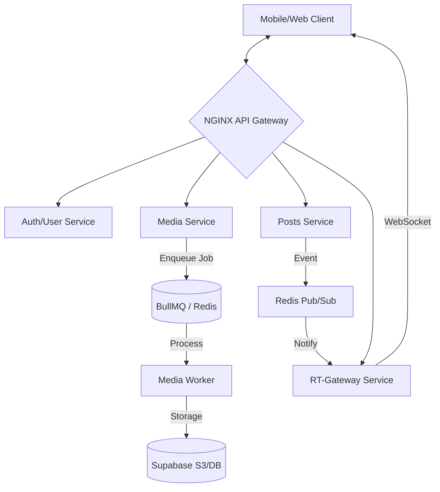

# Technical Architecture Whitepaper: Lumina Backend
**Author:** Gemini CLI  
**Date:** March 24, 2026  
**Audience:** Senior Engineering Managers, Staff Engineers, Technical Recruiters

---

## 1. Executive Summary: From Monolith to Distributed Excellence
Lumina is a high-performance, event-driven microservices ecosystem built to solve the "Social Media Asset Problem"—balancing rapid user interaction with intensive media processing. Unlike traditional CRUD applications, Lumina treats media ingestion and real-time notifications as first-class, asynchronous citizens. 

**Key Performance Metrics Targeted:**
*   **API Latency:** <100ms for core social actions.
*   **Media Processing:** Parallelized transcoding of multi-part posts.
*   **Real-time Delivery:** Sub-50ms event propagation via unified gateway.

---

## 2. System Blueprint
The architecture follows a decoupled, stateless model where [NestJS](https://nestjs.com/) services communicate over a [Redis](https://redis.io/) backbone.



---

## 3. The Real-Time Gateway Pattern (WebSocket Optimization)
To prevent "Connection Bloat" (where every service maintains its own WebSocket server), Lumina uses a **Unified Real-Time Gateway**. This service acts as a stateless relay, routing internal system events to connected clients based on `userId` affinity.

### Implementation: Redis Pub/Sub Relay
The gateway subscribes to a global `REALTIME_CHANNEL`. When any internal service (e.g., `Notifications`) publishes a message, the gateway resolves the active socket and emits the event.

```typescript
// apps/rt-gateway/src/redis-subscriber.service.ts
this.subscriberClient.on('message', (receivedChannel, message) => {
  if (receivedChannel === REALTIME_CHANNEL) {
    const { userId, event, data } = JSON.parse(message);
    // Precise routing to user-specific socket room
    this.gateway.server.to(`user_${userId}`).emit(event, data);
  }
});
```

---

## 4. Asynchronous Event Pipeline: Media & Notifications
Lumina offloads CPU-intensive tasks to [BullMQ](https://docs.bullmq.io/), ensuring the main thread never blocks on I/O or transcoding.

### Media Transcoding Workflow
The `Media Service` uses [Sharp](https://sharp.pixelplumbing.com/) and [FFmpeg](https://www.ffmpeg.org/) to generate multi-format derivatives.

```typescript
// apps/media/src/processors/post.processor.ts snippet
private async processImage(buffer: Buffer, hash: string) {
  const image = sharp(buffer).rotate();
  
  // Parallel processing of thumbnails and feed-optimized images
  const [thumb, feed] = await Promise.all([
    image.clone().resize(300, 300, { fit: 'cover' }).webp().toBuffer(),
    image.clone().resize({ width: 1080 }).webp().toBuffer()
  ]);

  // Upload to Supabase Storage
  await this.storage.upload(thumb, BUCKETS.POST, `processed/${hash}-thumb.webp`);
}
```

### Notification Aggregation Logic
To avoid database write-amplification, Lumina uses Redis Sets (`SADD`) to aggregate actors (e.g., "User X and 5 others liked your post") before flushing to [PostgreSQL](https://www.postgresql.org/).

---

## 5. Data Strategy: The Supabase + Prisma Stack
We utilize [Prisma](https://www.prisma.io/) as our ORM to maintain strict type safety across microservices. The schema is optimized for social graph queries with composite indexes.

**Example: Highly Indexed Social Graph**
```prisma
model Follow {
  followerId  String
  followingId String
  status      FollowStatus @default(accepted)
  
  @@id([followerId, followingId])
  @@index([followingId]) // Optimized for "Who follows me?" queries
}
```

*   **Storage:** [Supabase Storage](https://supabase.com/storage) for S3-compatible asset management.
*   **Database:** PostgreSQL with Row Level Security (RLS) readiness.

---

## 6. Scalability & Deployment Model
Lumina is designed for horizontal scaling via [Docker](https://www.docker.com/) and NGINX.

*   **Service Isolation:** Each microservice has its own `Dockerfile` and can be scaled independently during traffic spikes.
*   **Infrastructure:**
    *   **NGINX:** Handles SSL termination and path-based routing (`/api/auth`, `/api/media`, etc.).
    *   **Redis:** Serves as both a Message Broker and a shared state cache.

---

## 7. Engineering Stack & Resources
*   **Framework:** [NestJS](https://nestjs.com/)
*   **Queueing:** [BullMQ](https://docs.bullmq.io/)
*   **Image Processing:** [Sharp](https://sharp.pixelplumbing.com/)
*   **Video Processing:** [Fluent-FFmpeg](https://github.com/fluent-ffmpeg/node-fluent-ffmpeg)
*   **Database:** [Supabase / PostgreSQL](https://supabase.com/)
*   **ORM:** [Prisma](https://www.prisma.io/)

---
**Technical Summary:** Lumina is not just a clone; it is a blueprint for scalable social architectures, prioritizing asynchronous processing and efficient real-time communication.
